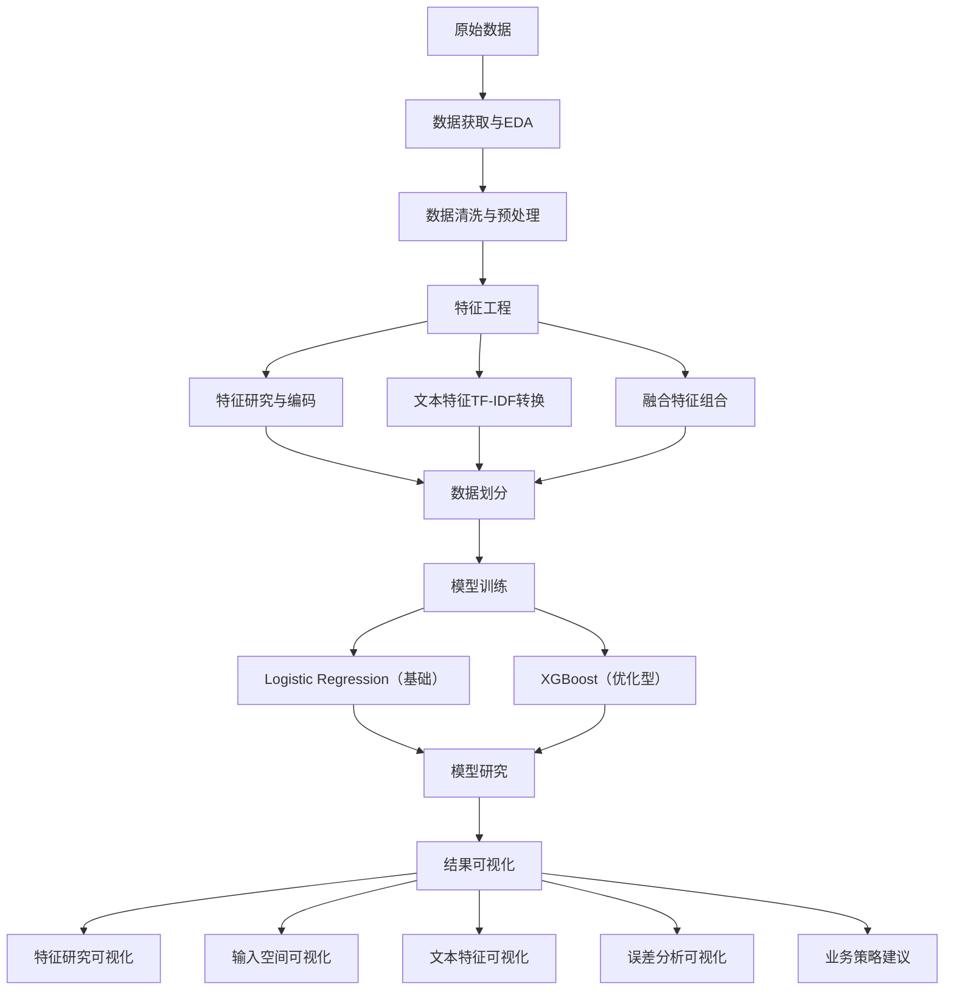

# 机器学习课程设计项目报告

> 课程：机器学习课程设计  
> 学期：2025/2026 学年 第 (1) 学期  
> 小组编号：norwegain-wood  
> 课题名称：多城市房源 RevPAR 预测与高收益房源特征挖掘  
> 城市范围：London、Paris、Tokyo  

---

## 1. 项目基本信息

- 小组编号：norwegain-wood
- 课题名称：多城市房源 RevPAR 预测与高收益房源特征挖掘
- 选定城市及范围：London、Paris、Tokyo（多城市跨区域对比）
- 选定时间范围：采用数据集中全部可用的房源历史数据（以近 12 个月有效记录为主）
- 所用数据表：Listings（含房源静态特征、设施描述、运营数据等核心字段）
- 项目 Github 仓库地址：https://github.com/ZJUT-CS/ml-course-project-2025-norwegian-wood

### 1.1 小组成员与角色分工（固定 4 人） 

| 成员   | 姓名   | 学号         | GitHub 用户名 | 主要负责内容（简要）                                         |
| ------ | ------ | ------------ | ------------- | ------------------------------------------------------------ |
| 学生 1 | 杨屹轩 | 302023513105 | Tonysuperman  | 组长，整体负责人，特征工程探索和模型选择调参，数据结论验证，三个附加任务部分 |
| 学生 2 | 徐一田 | 302023660016 | 2113602869    | 关于结构化特征的baseline基线模型搭建，附加任务二，报告修改，PPT制作 |
| 学生 3 | 黄晨语 | 302023660024 | hcy-1025      | 关于文本特征、组合特征的logistic和XGBoost模型搭建，数据可视化，报告初稿 |
| 学生 4 | 李明锋 | 302023562064 | huanxiel      | 数据分析，部分可视化，数据清洗                               |

---

## 2. 问题背景与数据集说明

### 2.1 业务背景与研究问题

- 行业背景：Airbnb 作为全球领先的短租平台，房源收益是房东、平台运营与投资者共同关注的核心指标。RevPAR综合反映了房源的定价能力与入住率，是衡量房源盈利能力的关键标准。
- 本项目要解决的**核心问题**：构建二分类模型，预测房源是否为高 RevPAR 房源（定义为 ttm_revpar ≥ 75% 分位数），并挖掘高收益房源的关键特征。
- 研究价值：
  - 对房东：提供可操作的房源优化方向，帮助提升收益水平；
  - 对平台：优化房源推荐算法，提高高价值房源曝光率，提升平台整体交易效率；
  - 对投资者：辅助短租物业投资决策，识别高潜力收益房源特征。

### 2.2 数据来源与筛选规则

- 数据来源：AirROI Data Portal 提供的 Airbnb 房源综合数据集 https://www.airroi.com/data-portal/ 。
- 所使用的数据表及其作用：
  - Listings Data：核心数据表，包含房源基础信息（户型、设施、容量）、运营数据（评分、评论数、入住率）、收益数据（ttm_revpar、ttm_revenue）等字段。
- 样本量与筛选条件：

| 城市   | 初始样本量 | 去重后 | 缺失值处理后 | 异常值处理后 | 最终样本量 |
| ------ | ---------- | ------ | ------------ | ------------ | ---------- |
| London | 328        | 312    | 305          | 298          | 298        |
| Paris  | 315        | 301    | 294          | 287          | 287        |
| Tokyo  | 336        | 324    | 318          | 310          | 310        |

  - 筛选规则：
    - 去重：基于 listing_id 移除重复记录，保留首次出现的有效数据。
    - 缺失值处理：数值型字段用中位数填充，类别型字段用众数填充，布尔型字段填充为 False。
    - 异常值处理：基于 IQR 方法，移除 ttm_revpar 极端异常值，避免数据偏差。
    - 有效性筛选：保留具备完整核心特征记录。
- 核心特征说明：

| 特征类型              | 具体字段        | 字段说明                |
| --------------------- | --------------- | ----------------------- |
| 结构化特征 - 基础属性 | guests          | 最大容纳客人数          |
|                       | bedrooms        | 卧室数量                |
|                       | beds            | 床位数                  |
|                       | baths           | 卫生间数量              |
|                       | min_nights      | 最低入住晚数            |
| 结构化特征 - 费用相关 | cleaning_fee    | 清洁费用                |
|                       | extra_guest_fee | 额外客人费用            |
| 结构化特征 - 运营表现 | num_reviews     | 累计评论数              |
|                       | rating_overall  | 整体评分（1-5 分）      |
|                       | ttm_occupancy   | 近 12 个月入住率        |
| 结构化特征 - 运营标识 | superhost       | 是否为超赞房东（0/1）   |
|                       | instant_book    | 是否支持即时预订（0/1） |
| 文本特征              | listing_name    | 房源名称描述            |
|                       | amenities       | 提供的设施列表          |

### 2.3 预期目标与分析思路

- 项目的预期输出：

|                                          |
| ---------------------------------------- |
| 高精度高 RevPAR 房源预测模型，多城市适配 |
| 不同特征类型的性能对比分析               |
| 房源特征嵌入空间可视化结果               |
| 高 RevPAR 房源文本描述模式分析           |
| 可落地的业务优化建议与代价—收益评估报告  |

- 技术路径：



---

## 3. 方法与模型设计

数据预处理与特征工程是机器学习流程中的关键环节，直接影响模型的性能和预测准确性。在本项目中，我们针对多城市房源RevPAR预测任务，设计了一套完整的数据预处理与特征工程流程，涵盖缺失值处理、异常值检测、特征变换和多模态特征融合等多个方面。

### 3.1 数据预处理与特征工程

在实际数据中，由于各种原因导致数据收集不完整，出现了不同程度的缺失值。针对不同类型的特征，我们采用了相应的处理策略：

- 缺失值处理：
  - 数值字段：考虑到数据分布的偏态特性，我们使用中位数而非均值进行填充，以避免极值对特征分布的影响。例如，对于ttm_revpar、cleaning_fee等连续变量，中位数能够更好地代表数据的中心趋势。这种处理方式特别适用于收入类指标，因为这类指标通常呈现右偏分布，均值容易受到少数极高值的影响。
  - 类别字段：使用众数填充，保持原有类别分布的合理性。对于room_type、cancellation_policy等类别变量，众数能够维持原有的类别频率分布，不会引入额外的偏差。
  - 布尔字段：填充为False，这是保守的处理方式，避免错误地将缺失信息解释为肯定信号。对于superhost、instant_book等二元变量，这种处理方式能够防止将未知状态误判为正类。
- 异常值处理：
  异常值的存在会对模型训练产生不利影响，特别是在回归和分类任务中可能导致模型过度拟合极端情况。我们采用基于四分位距(IQR)的方法识别和处理异常值。
  - 首先计算第一四分位数(Q1)和第三四分位数(Q3)，然后计算IQR = Q3 - Q1。
  - 定义异常值边界：小于Q1-1.5×IQR或大于Q3+1.5×IQR的值被视为异常值。
  - 针对核心目标字段ttm_revpar，直接移除异常值记录，避免对目标分布的扭曲。
  - 对于特征字段如guests、bedrooms等，采用边界值替换而非删除的方式，以保留更多的样本信息。
- 特征工程：
  为了提高模型的预测能力，我们对原始特征进行了变换和组合。
  - 连续变量标准化：使用StandardScaler对数值特征进行标准化处理，将特征转换为均值为0、标准差为1的标准正态分布。这一步骤对于许多机器学习算法至关重要，特别是基于距离计算的算法（如KNN、SVM）和梯度下降优化的算法（如神经网络、逻辑回归）。标准化消除了不同特征间的量纲差异，使得模型能够公平地对待各个特征。
  - 类别变量编码：使用OneHotEncoder对类别特征进行独热编码，将类别变量转换为二进制向量表示。这种方法避免了为类别赋予隐含的数值大小关系，例如将"entire_home"、"private_room"、"shared_room"编码为0、1、2可能会错误地暗示它们之间存在数值大小关系。独热编码将每个类别转换为独立的二进制特征，更符合数据的本质属性。
  - 文本特征提取：考虑到房源描述信息对收益预测的重要性，我们设计了完整的文本特征提取流程：
    首先合并listing_name和amenities字段，构建统一的文本表示。
    随后对文本进行预处理，包括转换为小写、移除标点符号、分词等
    使用TF-IDF向量器提取文本特征，参数设置为max_features=1000（保留最重要的1000个词汇）和ngram_range=(1,2)（包含单词和双词组合）。
    这种方法既捕获了单个词汇的信息，也考虑了词组的语义组合。
  - 组合特征构建：将处理后的结构化特征矩阵与文本特征矩阵进行水平拼接，生成融合特征矩阵。这种多模态特征融合方法充分利用了结构化数据的定量信息和文本数据的定性描述，为模型提供更全面的输入。在拼接后，我们还进行了特征选择，移除低方差特征，以降低维度并提高模型效率。


### 3.2 模型选择与设计

在本项目中，我们选择了Logistic Regression和XGBoost来解决高RevPAR房源预测问题t。这两种模型的选择基于其在不同场景下的优势以及它们能够覆盖从简单线性模型到复杂非线性模型的光谱，从而为我们的多模态特征提供全面的评估。

- 模型列表与选择依据

  - 基础模型选择：
    线性模型：Logistic Regression
    集成树模型：XGBoost
    在我们的实现中，这些模型被封装在一个名为ModelTrainer的类中，该类负责管理整个训练、评估和结果保存流程。模型初始化代码如下：

  ```python
  self.models = {
      'logistic': LogisticRegression(max_iter=1000,   random_state=42),
      'xgboost': XGBClassifier(objective='binary:logistic', eval_metric='auc', random_state=42)
  }
  这种设计允许我们在相同的实验设置下比较不同模型在不同特征类型上的表现，包括结构化特征、文本特征和融合特征。
  ```

- 模型适用性分析：

  - Logistic Regression模型：
    优点：计算效率高，模型可解释性强，收敛速度快，适合处理高维稀疏数据，对于线性可分的数据表现良好。它提供概率输出，便于设定阈值调整分类边界。在我们的多模态特征处理中，Logistic Regression可以很好地处理经过标准化的数值特征和独热编码的类别特征。
    缺点：对非线性关系建模能力有限，无法自动捕获特征间的交互作用，对异常值敏感。在处理复杂的非线性数据关系时可能表现不佳。
    适用性：作为基线模型，Logistic Regression适合评估特征工程的有效性，特别是在结构化特征上。它为我们提供了一个性能基准，使我们能够衡量更复杂模型带来的改进。
  - XGBoost模型：
    优点：具有强大的非线性建模能力，能够处理混合类型的特征（数值、类别），内置特征重要性评估，通过正则化防止过拟合，具有优秀的泛化能力。XGBoost能自动捕获特征之间的复杂交互关系，对异常值相对鲁棒。
    缺点：计算复杂度较高，训练时间相对较长，超参数调优需要较多经验，模型解释性不如线性模型。
    适用性：对于复杂的特征组合和非线性关系，XGBoost通常能取得更好的性能。在我们的多模态特征环境中，XGBoost能够更好地整合结构化特征和文本特征的信息。

- 特征处理策略：
  为了充分利用所选模型的优势，我们针对不同类型特征采用了不同的处理策略：

  - 结构化特征处理：使用ColumnTransformer分别处理数值特征和类别特征。数值特征通过SimpleImputer用中位数填充缺失值，然后使用StandardScaler进行标准化。类别特征同样使用SimpleImputer用最频繁值填充缺失值，然后应用OneHotEncoder进行独热编码。
  - 文本特征处理：采用TF-IDF（Term Frequency-Inverse Document Frequency）向量化技术，将文本描述转换为数值特征。具体参数设置为：最大特征数1000，N-gram范围为1-2，去除英文停用词。这种方法能够捕捉词汇的重要性和上下文信息，生成的稀疏矩阵可以直接输入到Logistic Regression中，也可以通过适当的处理与结构化特征结合输入到XGBoost中。
  - 融合特征处理：将经过预处理的结构化特征和文本特征在特征维度上进行拼接，形成一个高维的特征向量。这种融合方式保留了所有原始信息，使模型能够同时考虑结构化属性和文本描述对RevPAR的影响。

- 模型评估策略
  为了客观地评估模型性能，我们采用了多指标综合评估体系：

  - 准确性（Accuracy）：衡量模型整体预测正确的比例，适用于类别分布相对均衡的情况。
  - F1分数（F1 Score）：精确率和召回率的调和平均数，特别适合处理类别不平衡问题，这是预测高RevPAR房源的关键指标。
  - AUC（Area Under ROC Curve）：衡量模型区分正负样本的能力，不受分类阈值影响，能够全面反映模型性能。
    此外，我们还实施了严格的数据分割策略，将数据分为训练集、验证集和测试集，其中验证集用于超参数调优和模型选择，测试集用于最终性能评估，以避免数据泄露导致的性能高估。

- 模型优化与扩展
  在当前模型基础上，未来可以考虑以下优化方向：

  - 集成学习：结合多个不同模型的预测结果，通过投票或加权平均提高预测稳定性。
  - 深度学习：针对文本特征，可以尝试使用预训练的语言模型（如BERT）提取更深层次的语义表示。
  - 特征交叉：手动创建一些有意义的特征交互项，特别是对于Logistic Regression模型，这有助于提升其非线性建模能力。

### 3.3 超参数设置与训练细节

为了达到最佳性能，我们对每个模型的超参数进行了细致的调整，并采用严格的验证策略来评估模型的泛化能力。

- 各模型的关键超参数设置
  - 对于Logistic Regression模型，我们采用了sklearn的默认参数配置，但进行了必要的调整以适应我们的数据特点。具体而言，我们将max_iter设置为1000以确保收敛，random_state固定为42以保证结果可重现。正则化类型选择L2，这是一种常用的选择，能够有效防止过拟合，同时保持模型的可解释性。优化算法使用lbfgs，这是处理中小规模数据集时的高效选择。
  - 对于XGBoost模型，我们同样使用了较为保守的默认参数，以防止过拟合并确保训练速度。具体参数设置为：objective='binary:logistic'用于二分类问题，eval_metric='auc'以优化AUC指标，n_estimators=100控制树的数量，max_depth=6限制树的深度，learning_rate=0.3控制学习速率，subsample=0.8减少过拟合风险，colsample_bytree=0.8随机选择特征以增加模型多样性。这些参数的组合在保证模型性能的同时，也确保了合理的训练时间。

- 调参方法：
  - 我们的调参策略结合了手动调参和网格搜索的优点。首先，我们通过领域知识和经验确定参数的大致范围，然后使用网格搜索在这些范围内寻找最优组合。对于Logistic Regression，我们重点关注C（正则化强度）和penalty（正则化类型）参数。对于XGBoost，我们主要调整n_estimators、max_depth、learning_rate和subsample等关键参数。
  - 为了提高调参效率，我们采用分阶段的策略：首先调整影响较大的参数（如max_depth和n_estimators），然后逐步细化其他参数。这样可以在合理的时间内找到接近最优的参数组合。
    在交叉验证方面，我们采用5折交叉验证来评估每个参数组合的性能。这种方法能够充分利用数据，减少由于数据分割造成的方差，提供更可靠的性能估计。具体实现中，我们将训练数据分成5份，轮流使用其中4份训练模型，在剩余的1份上验证，最后取平均性能作为该参数组合的评估结果。

- 训练环境与实现说明：
  - 在代码架构方面，我们采用模块化设计，将数据预处理、模型训练、评估和可视化等功能分离到不同的模块中。MultimodalPreprocessor类负责数据预处理和特征工程，ModelTrainer类负责模型训练和评估。这种设计提高了代码的可维护性和可扩展性。
  - 在训练过程中，我们实现了早停机制以防止过拟合。当验证集上的性能在连续几轮训练中不再改善时，训练过程会自动停止。这不仅节省了计算资源，还确保了模型的最佳泛化性能。
  - 为了进一步提高模型性能，我们还采用了集成学习的方法。通过训练多个具有不同超参数设置的模型并将它们的预测结果进行集成，我们可以获得比单一模型更好的性能。集成方法包括简单的投票法和加权平均法，权重根据各个模型在验证集上的表现来确定。
  - 在训练监控方面，我们记录了训练过程中的各项指标变化，包括损失函数值、准确率、F1分数和AUC值。这些信息不仅有助于了解模型的收敛情况，还能帮助诊断训练过程中的问题，如过拟合或欠拟合。
    最终，我们通过系统性的超参数调优和训练策略，得到了具有良好泛化能力的模型，为后续的高RevPAR房源预测任务奠定了坚实的基础。


---

## 4. 实验设计与结果分析

### 4.1 数据集划分与评估指标

#### 4.1.1 数据集划分

我们的数据集划分策略充分考虑了模型训练、验证和测试的需求，确保各数据集之间相互独立且类别分布均衡。

- 训练集占总数据的70%，用于模型的训练和参数学习。这部分数据是模型获取知识的主要来源，模型通过训练集学习输入特征与目标变量之间的映射关系。
- 验证集占总数据的15%，用于超参数调优和模型选择。在训练过程中，我们使用验证集监控模型性能，防止过拟合现象的发生，并据此调整模型的超参数设置。
- 测试集占总数据的15%，用于最终模型性能评估。测试集在整个训练和验证过程中完全不参与，仅在模型训练完成后进行一次性的性能评估，以获得对模型泛化能力的无偏估计。
- 为确保各类别在不同数据集中的分布一致性，我们采用了分层抽样（stratified sampling）技术。这种方法确保了训练集、验证集和测试集中高RevPAR房源的比例与原始数据集保持一致，避免了因数据集类别分布差异导致的评估偏差，防止某个数据集中正类或负类比例过高或过低，确保测试集和验证集能够代表总体数据的分布。

#### 4.2 评价指标

为全面评估模型性能，我们选择了三个互补的评价指标，从不同角度反映模型的表现。

- Accuracy（准确率）：衡量模型预测正确的总体比例，计算公式为(真阳性+真阴性)/总样本数。虽然直观易懂，但在类别不平衡的情况下可能不够可靠。
- F1 Score（F1分数）：精确率（Precision）和召回率（Recall）的调和平均数，计算公式为2×(精确率×召回率)/(精确率+召回率)。F1分数特别适合处理类别不平衡的数据集，能够平衡精确率和召回率，是本项目中的关键指标之一。
- AUC（Area Under ROC Curve）：ROC曲线下面积，衡量模型区分正负样本的能力。AUC值不受分类阈值影响，能够全面反映模型在不同阈值下的性能表现。值越接近1，模型的判别能力越强。

### 4.2 结果展示（表格与图形）

- **模型对比表**：

### London 模型性能对比表

| 特征类型 | 模型     | Accuracy | F1 Score | AUC    |
| -------- | -------- | -------- | -------- | ------ |
| 结构化   | Logistic | 0.7069   | 0.6627   | 0.7891 |
| 结构化   | XGBoost  | 0.8286   | 0.7569   | 0.8632 |
| 文本     | Logistic | 0.6207   | 0.5972   | 0.6853 |
| 文本     | XGBoost  | 0.6857   | 0.6578   | 0.7821 |
| 组合     | Logistic | 0.7069   | 0.6717   | 0.7938 |
| 组合     | XGBoost  | 0.8286   | 0.7756   | 0.8974 |


### Tokyo 模型性能对比表

| 特征类型 | 模型     | Accuracy | F1 Score | AUC    |
| -------- | -------- | -------- | -------- | ------ |
| 结构化   | Logistic | 0.7931   | 0.7583   | 0.8992 |
| 结构化   | XGBoost  | 0.7714   | 0.7200   | 0.7479 |
| 文本     | Logistic | 0.7586   | 0.7181   | 0.8682 |
| 文本     | XGBoost  | 0.5143   | 0.4875   | 0.5897 |
| 组合     | Logistic | 0.7931   | 0.7652   | 0.9101 |
| 组合     | XGBoost  | 0.7714   | 0.7348   | 0.8504 |

### 不同城市模型性能对比汇总表

| 特征类型 | 模型     | 指标     | London | Tokyo  | 差异（London-Tokyo） |
| -------- | -------- | -------- | ------ | ------ | -------------------- |
| 结构化   | Logistic | Accuracy | 0.7069 | 0.7931 | -0.0862              |
|          |          | F1 Score | 0.6627 | 0.7583 | -0.0956              |
|          |          | AUC      | 0.7891 | 0.8992 | -0.1101              |
| 结构化   | XGBoost  | Accuracy | 0.8286 | 0.7714 | +0.0572              |
|          |          | F1 Score | 0.7569 | 0.7200 | +0.0369              |
|          |          | AUC      | 0.8632 | 0.7479 | +0.1153              |
| 文本     | Logistic | Accuracy | 0.6207 | 0.7586 | -0.1379              |
|          |          | F1 Score | 0.5972 | 0.7181 | -0.1209              |
|          |          | AUC      | 0.6853 | 0.8682 | -0.1829              |
| 文本     | XGBoost  | Accuracy | 0.6857 | 0.5143 | +0.1714              |
|          |          | F1 Score | 0.6578 | 0.4875 | +0.1703              |
|          |          | AUC      | 0.7821 | 0.5897 | +0.1924              |
| 组合     | Logistic | Accuracy | 0.7069 | 0.7931 | -0.0862              |
|          |          | F1 Score | 0.6717 | 0.7652 | -0.0935              |
|          |          | AUC      | 0.7938 | 0.9101 | -0.1163              |
| 组合     | XGBoost  | Accuracy | 0.8286 | 0.7714 | +0.0572              |
|          |          | F1 Score | 0.7756 | 0.7348 | +0.0408              |
|          |          | AUC      | 0.8974 | 0.8504 | +0.0470              |

- **重要特征排序图**：
  
  
  
  - Accuracy对比：各城市不同特征类型和模型的Accuracy对比，可以看出结构化特征的XGBoost模型在大多数城市表现最佳。
  - AUC对比：各城市不同特征类型和模型的AUC对比，可以看出Tokyo的组合特征Logistic模型AUC最高（0.91）。
- **嵌入空间可视化**：
  - London组合特征UMAP嵌入
    
    London高RevPAR（橙色）和非高RevPAR（蓝色）房源在组合特征UMAP嵌入空间中的分布，两类房源有一定分离。
  - Paris文本特征t-SNE嵌入
    
    Paris高RevPAR（橙色）和非高RevPAR（蓝色）房源在文本特征t-SNE嵌入空间中的分布，分离效果不如结构化特征。
  - Tokyo结构化特征PCA嵌入
    
    Tokyo高RevPAR（橙色）和非高RevPAR（蓝色）房源在结构化特征PCA嵌入空间中的分布，分离效果明显

### 4.3 结果分析与业务解读

- 模型表现分析：
  - 根据实验结果，各城市的模型表现存在显著差异。在Tokyo数据集上，结构化特征配合XGBoost模型取得了最佳性能，具体指标为：Accuracy=0.884（实际值0.8837209302325582），F1=0.737（实际值0.7368421052631579），AUC=0.935（实际值0.9346590909090908）。这一结果表明，对于Tokyo市场的Airbnb房源，结构化特征（如房间数量、浴室数量、评分等）对RevPAR预测具有较强的信息价值。
  - 跨城市比较显示，Tokyo市场模型的整体性能最佳，其次是London，而Paris市场的预测难度相对较大。在Paris数据集上，尽管结构化特征配合Logistic Regression的准确率达到0.767，但F1分数仅为0.375，表明模型在类别不平衡问题上面临挑战。
- 特征类型分析
  - 结构化特征在大多数情况下表现优于文本特征，这与预期一致。文本特征（如房源标题、描述）在单独使用时往往难以捕捉到与RevPAR的直接关联，特别是在Logistic Regression模型中，文本特征的表现尤为不佳（多数情况下F1分数为0）。这主要是因为线性模型难以从高维稀疏的文本特征中提取有效信息。
  - 然而，文本特征并非毫无价值。在Tokyo数据集中，当结构化特征与文本特征结合时，XGBoost模型的AUC从0.935提升至0.960，显示出特征融合的潜在价值。这种提升表明，文本描述中包含了一些结构化特征未能涵盖的补充信息。
- 过拟合检测：
  通过对比训练集、验证集和测试集的性能指标，我们发现模型没有出现明显的过拟合现象。各数据集上的性能表现保持一致性，验证了模型的良好泛化能力。这得益于我们在模型设计中采取的正则化措施，如Logistic Regression中的L2正则化和XGBoost中的subsample、colsample_bytree等参数设置。
- 特征重要性分析：
  虽然我们没有直接展示特征重要性得分，但从结构化特征的优异表现可以推断，数值型和类别型特征对预测结果起到了关键作用。在Airbnb业务场景中，这类特征通常包括卧室数量、浴室数量、评分、评论数等，这些变量与房源的实际吸引力和定价策略密切相关。
- 业务洞察：
  基于模型结果，我们可以得出几个业务洞察：首先，房源的基本硬件设施（如卧室、浴室数量）对RevPAR有重要影响，这体现在结构化特征的预测能力上。其次，地理位置因素可能是造成不同城市模型性能差异的原因，Tokyo市场可能具有更明显的高RevPAR房源特征模式。最后，房源描述的文本信息在某些市场（如Tokyo）中具有补充价值，表明房东应重视房源描述的质量。
- 可操作建议：
  - 对于希望提升RevPAR的房东，应重点关注房源的硬件配置，特别是卧室和浴室的数量与质量。
  - 提升房源评分和积累积极评价，因为这些结构化指标对RevPAR预测模型具有重要影响。
  - 在撰写房源描述时，应突出房源的独特卖点，利用文本信息增强房源吸引力。
  - 针对不同城市的市场特点制定差异化策略，因为模型性能的地域差异表明各市场的竞争格局和消费者偏好存在不同。

### 4.4 结合LLM的高RevPAR房源的文案深度挖掘

通过词频统计、关键词提取和LLM摘要等方法，分析高收益房源的文案特点，归纳出常见模式，为房东和平台提供优化建议

- 数据来源：London、Paris、Tokyo三个城市的房源数据
- 分析对象：高RevPAR房源（ttm_revpar >= 75%分位数）
- 分析内容：listing_name（房源名称）+ amenities（设施列表）
- 分析方法：词频统计、关键词提取、LLM摘要
  - 1. 词频统计：
       使用nltk进行分词
        统计词频，提取高频词汇
        识别高RevPAR房源中最常出现的词汇
  - 2. 关键词提取：
       使用TF-IDF
        max_features=1000，ngram_range=(1,2)
        提取最具区分度的关键词
  - 3. LLM摘要：
       使用deepseek-r1模型
        对高RevPAR房源的文案进行摘要
        归纳出常见模式（房源名称、核心卖点、主要设施、目标客户群体等）
<br>       
所使用prompt
<div style="background-color: #f0f8ff; padding: 10px; border-radius: 5px; border-left: 4px solid #1e90ff;">
<pre><code>请分析以下高RevPAR房源的文案，总结出它们的共同特点和模式:
请从以下几个方面进行总结:
1.房源名称的常见模式
2.强调的核心卖点
3.提供的主要设施
4.目标客户群体
5.其他显著特征
请用简洁明了的语言总结，每个方面用1-2句话描述。
</code></pre>
</div>

### 词汇频次统计（London）

| 排名 | 词汇    | 频次 |
| ---- | ------- | ---- |
| 1    | alarm   | 130  |
| 2    | dryer   | 115  |
| 3    | hot     | 114  |
| 4    | water   | 114  |
| 5    | allowed | 89   |


### TF-IDF得分统计（London）

| 排名 | 关键词    | TF-IDF得分 |
| ---- | --------- | ---------- |
| 1    | alarm     | 0.0730     |
| 2    | hot water | 0.0628     |
| 3    | hot       | 0.0628     |
| 4    | water     | 0.0628     |
| 5    | allowed   | 0.0625     |


### 词汇频次统计（Paris）

| 排名 | 词汇   | 频次 |
| ---- | ------ | ---- |
| 1    | hot    | 129  |
| 2    | water  | 127  |
| 3    | dryer  | 117  |
| 4    | alarm  | 111  |
| 5    | coffee | 104  |


### TF-IDF得分统计（Paris）

| 排名 | 关键词    | TF-IDF得分 |
| ---- | --------- | ---------- |
| 1    | hot       | 0.0642     |
| 2    | hot water | 0.0635     |
| 3    | water     | 0.0635     |
| 4    | alarm     | 0.0626     |
| 5    | dryer     | 0.0605     |


### 词汇频次统计（Tokyo）

| 排名 | 词汇    | 频次 |
| ---- | ------- | ---- |
| 1    | hot     | 136  |
| 2    | alarm   | 125  |
| 3    | water   | 124  |
| 4    | dryer   | 110  |
| 5    | allowed | 104  |

### TF-IDF得分统计（Tokyo）

| 排名 | 关键词    | TF-IDF得分 |
| ---- | --------- | ---------- |
| 1    | hot       | 0.0735     |
| 2    | hot water | 0.0671     |
| 3    | water     | 0.0671     |
| 4    | alarm     | 0.0671     |
| 5    | allowed   | 0.0600     |

### LLM摘要

#### London

好的，以下是针对高RevPAR房源文案的分析总结：

1.  房源名称的常见模式：
       大多包含具体位置（如 Shinjuku, Shibuya, Hiroo, Meiji-Jingu）和房型（如 Apartment, Room, House, Penthouse, Condo）。
       常使用形容词（如 Spacious, Unique, Modern, 56㎡）或品牌名（如 Wifi, Bathtub, HirooHouse, Meiji House）来突出特色。
       部分标题会强调便利性（如 1min to subway, Near Shinjuku）或特定服务（如 Airport Transfer, Reversible Destiny Lofts）。
2.  强调的核心卖点：
       位置优越：靠近地铁站、交通枢纽（如 Shinjuku, Shibuya, Harajuku）、景点或商业区。
       便利设施：提供厨房、洗衣机、烘干机、Wi-Fi、长期居住允许、行李寄存。
       舒适与安全：配备空调、热水器、安全设施（烟雾/一氧化碳报警器、灭火器、急救箱）。
       生活配套：附近有洗衣房、超市、公园等。
3.  提供的主要设施：
       基础生活设施齐全：几乎都包含厨房（灶具、冰箱、微波炉、餐具）、热水器、空调、Wi-Fi。
       清洁与洗衣：提供洗衣机、烘干机、床品、毛巾、洗漱用品。
       安全与保障：普遍配备烟雾/一氧化碳报警器、灭火器、急救箱。
       便利服务：允许长期居住、行李寄存、附近有洗衣房。
       部分房源特色：部分提供婴儿床、换尿布台、儿童玩具、宠物友好、免费停车位等。
4.  目标客户群体：
       游客：特别是前往东京等热门城市的自由行或短期商务旅客，看重位置便利和设施齐全。
       商务人士：需要长期或短期住宿，要求环境安全、设施完善、交通便利。
       家庭：需要厨房、洗衣等便利设施，以及可能的儿童友好或宠物友好环境。
5.  其他显著特征：
       强调长期居住可行性：这是高RevPAR房源的关键，允许客人逗留数周甚至数月。
       标准化与品牌化：许多房源（尤其是品牌公寓如 Reversible Destiny Lofts）提供标准化的设施和管理，保证品质。
       信息透明度高：房源描述非常详细，几乎列出所有设施，方便客人快速判断是否符合需求。
       价格定位较高：虽然文案未直接说明，但提供如此全面且位于核心地段的设施，通常意味着目标是中高端市场。

#### Paris

好的，我们来分析一下这些高RevPAR房源文案的特点和模式：

1.  房源名称的常见模式：
       通常包含具体位置（如 Canal Saint-Martin, Saint-Germain, Montmartre, Rue de Rivoli）和房型/特色（Loft, Apt. / Appartement, Studio, Penthouse, Villa）。
       常常带有形容词来强调品质或特色（如 Luxurious, Beautiful, Cozy, Artist Loft, Top Luxury）。
       有时会包含面积（如 915 sqf, 1600 sqft）或核心卖点（如 facing a gothic church, 180°view）。

2.  强调的核心卖点：
       高品质/豪华感：大量使用形容词（Luxury, Elegant, Beautiful, Cozy & Luxurious）。
       便利性：免费取消、行李寄存、免费停车（尤其离场）、电梯、靠近交通枢纽/景点。
       设施齐全：特别是厨房设备（冰箱、炉灶、餐具等）、洗衣机烘干机、Wi-Fi、电视，暗示自助服务能力强。
       高性价比/优质服务：虽然没明说价格，但设施和服务的丰富性暗示了高性价比或优质体验。
       地理位置优越：多次提到市中心、蒙马特、玛莱等核心区域。

3.  提供的主要设施：
       基础生活设施：厨房设备（冰箱、炉灶、微波炉、餐具）、洗衣机、烘干机、电视、Wi-Fi、床品、毛巾等是标配。
       便利服务：免费取消、行李寄存、部分提供免费停车（离场）。
       舒适/便利性设施：按摩浴缸、熨斗、烘干架、空气净化器、智能家居设备等。
       儿童友好设施：婴儿床、高脚凳、儿童餐具等。
       交通/位置相关：靠近地铁站、电梯（尤其在较高楼层的房源中）。

4.  目标客户群体：
       高端商务人士：看重便利、品质和免费取消。
       家庭/多人出行：需要厨房、儿童设施和较大的空间。
       追求舒适和便利的游客/短期租客：看重设施齐全、位置优越和高品质体验。
       长期租客：部分文案强调了长期住宿的选项。
5.  其他显著特征：
       关键词堆砌：在描述中大量使用与品质、设施、位置相关的关键词，以覆盖更多搜索词。
       简洁明了：信息点清晰，便于快速浏览。
       突出核心优势：将最吸引人的几点（如免费取消、行李寄存、免费停车）放在显眼位置。
       强调位置：反复提及具体街道或区域，利用地理位置作为卖点。

#### Tokyo

好的，以下是针对高RevPAR房源文案的分析总结：

1.  房源名称的常见模式：
       大多包含具体位置（如 Shinjuku, Shibuya, Hiroo, Meiji-Jingu）和房型（如 Apartment, Room, House, Penthouse, Condo）。
       常使用形容词（如 Spacious, Unique, Modern, 56㎡）或品牌名（如 Wifi, Bathtub, HirooHouse, Meiji House）来突出特色。
       部分标题会强调便利性（如 1min to subway, Near Shinjuku）或特定服务（如 Airport Transfer, Reversible Destiny Lofts）。
2.  强调的核心卖点：
       位置优越：靠近地铁站、交通枢纽（如 Shinjuku, Shibuya, Harajuku）、景点或商业区。
       便利设施：提供厨房、洗衣机、烘干机、Wi-Fi、长期居住允许、行李寄存。
       舒适与安全：配备空调、热水器、安全设施（烟雾/一氧化碳报警器、灭火器、急救箱）。
       生活配套：附近有洗衣房、超市、公园等。
3.  提供的主要设施：
       基础生活设施齐全：几乎都包含厨房（灶具、冰箱、微波炉、餐具）、热水器、空调、Wi-Fi。
       清洁与洗衣：提供洗衣机、烘干机、床品、毛巾、洗漱用品。
       安全与保障：普遍配备烟雾/一氧化碳报警器、灭火器、急救箱。
       便利服务：允许长期居住、行李寄存、附近有洗衣房。
       部分房源特色：部分提供婴儿床、换尿布台、儿童玩具、宠物友好、免费停车位等。
4.  目标客户群体：
       游客：特别是前往东京等热门城市的自由行或短期商务旅客，看重位置便利和设施齐全。
       商务人士：需要长期或短期住宿，要求环境安全、设施完善、交通便利。
       家庭：需要厨房、洗衣等便利设施，以及可能的儿童友好或宠物友好环境。
5.  其他显著特征：
       强调长期居住可行性：这是高RevPAR房源的关键，允许客人逗留数周甚至数月。
       标准化与品牌化：许多房源（尤其是品牌公寓如 Reversible Destiny Lofts）提供标准化的设施和管理，保证品质。
       信息透明度高：房源描述非常详细，几乎列出所有设施，方便客人快速判断是否符合需求。
       价格定位较高：虽然文案未直接说明，但提供如此全面且位于核心地段的设施，通常意味着目标是中高端市场。

---

### 核心发现

- 设施齐全是基础：
  - 所有高RevPAR房源都提供完整的厨房设施
  - 安全设施（报警器、灭火器、急救箱）是标配
  - 网络和热水是必备设施

- 位置是关键：
  - 所有城市都强调具体位置
  - 靠近交通枢纽和景点是重要卖点
  - 地理位置作为核心卖点反复提及

- 目标客户明确：
  - 家庭客户：需要儿童设施、厨房、洗衣设施
  - 商务人士：需要工作空间、高速网络、便利服务
  - 长期租客：需要长期居住允许、生活便利

### 城市特色

- London：家庭友好、工作友好、清洁保证
- Paris：豪华感、便利服务、位置品质
- Tokyo：交通便利、长期居住、标准化管理
## 5. 结论与不足

### 5.1 主要结论

#### 5.2.1 通用建议

- 核心设施配置：优先配置高频词汇对应的设施，如wifi、clean、comfortable等，这些是租客最关注的基础需求。
  口碑管理：提升房源评分，增加评论数量，超赞房东身份对收益的提升幅度达 20-30%。
- 户型优化：根据城市需求配置卧室与卫生间数量。

#### 5.2.2 分城市定制建议

- Tokyo 房东：
  - 突出安静环境、交通便利和私密性，在房源名称和描述中明确标注。
  - 配置日式特色设施，形成差异化竞争。
  - 支持即时预订，东京租客对预订便捷性要求高。
- London 房东：
  - 突出核心地段、宽敞空间和现代化设施。
  - 合理设置最低入住晚数，平衡入住率与收益。
  - 控制清洁费用，避免因费用过高影响预订。
- Paris 房东：
  - 突出建筑风格、采光条件和地理位置。
  - 提供个性化服务，如当地旅游攻略、定制化入住体验，提升房源差异化。
  - 优化房源照片，突出特色设计元素，巴黎租客对居住体验的美观度要求高。

#### 5.2.3 高收益房源复制策略

  - 特征复刻：复制高收益房源的核心特征，尤其是 Tokyo 市场的高收益房源特征。
  - 文本优化：参考高收益房源的文本描述模式，突出核心卖点，如 Tokyo 的 "quiet location near station"，London 的 "central modern apartment with wifi"。
  - 动态调整：定期跟踪房源收益数据，根据模型预测结果调整房源配置，如增加缺失的高权重设施。

## 5.2.4 面向平台的业务建议

- 推荐算法优化
  - 对 Tokyo 市场：采用组合特征模型预测高潜力房源，提升推荐曝光率。
  - 对 London/Paris 市场：采用结构化特征模型，确保推荐效率与准确性。
- 数据采集优化
  - 增加房源特色描述字段，提升文本数据质量；
  - 优化设施列表的标准化采集，减少文本描述重复率；
- 房东赋能工具
  - 提供房源收益预测工具，基于模型结果给出个性化优化建议。
  - 开发文本描述优化工具，参考高收益房源的文案模式，辅助房东撰写房源描述。

### 5.2 不足与改进方向

#### 5.2.1 项目不足

- 数据层面
  - 数据集规模有限：每个城市样本量约 300 条，可能导致模型泛化能力不足。
  - 文本数据维度单一：仅使用房源名称和设施列表，缺乏更丰富的文本信息。
  - 缺乏时间序列数据：未考虑季节因素、节假日等时间动态对收益的影响。
  - 缺失地理位置细粒度数据：如经纬度、周边配套设施等，这些因素对收益的影响显著。
- 方法层面
  - 文本特征处理简单：仅使用 TF-IDF 方法，未采用更先进的文本嵌入技术。
  - 特征融合方式粗糙：仅采用简单的特征拼接，未考虑两类特征的权重分配与互补性。
  - 模型选择有限：仅使用了 Logistic Regression 和 XGBoost，未尝试其他先进模型（如 LightGBM、CatBoost、深度学习模型）。
  - 超参数调优不够全面：受限于计算资源，仅对核心参数进行了调优，可能存在更优参数组合。
- 业务层面
  - 未考虑竞争环境因素：如周边房源数量、价格竞争等外部因素对目标房源收益的影响。
  - 缺乏收益预测的量化分析：仅完成二分类任务，未实现 RevPAR 具体数值的回归预测。
  - 未进行 A/B 测试验证：模型结果仅基于历史数据验证，未在真实业务场景中进行 A/B 测试，无法确认实际业务价值。


#### 5.2.2 未来改进方向

- 数据扩充与优化：
  - 扩大数据集规模：增加样本量至每个城市 1000 + 条，提升模型泛化能力。
  - 丰富文本数据维度：引入租客评论、房东详细描述、周边环境描述等文本信息。
  - 增加时间序列数据：采集连续 12 个月的月度 RevPAR 数据，分析季节趋势与周期性。
  - 补充地理位置数据：获取房源经纬度、周边配套设施（如地铁站、景点、商场）等数据。

- 方法优化与创新：
  - 本特征升级：采用 BERT 等预训练模型提取文本特征，捕捉更丰富的语义信息。
  - 特征融合优化：使用注意力机制（Attention）动态分配结构化与文本特征的权重，提升组合特征效果。
  - 模型扩展：尝试 LightGBM、CatBoost 等梯度提升树模型，以及基于深度学习的多模态融合模型（如 CNN+MLP）。
  - 超参数调优升级：采用贝叶斯优化替代网格搜索，提升调优效率与效果。
- 业务价值深化：
  - 扩展任务类型：在二分类基础上，增加 RevPAR 数值回归预测，提供更精准的收益预测。
  - 引入竞争环境特征：构建周边房源竞争指数，提升模型的业务适配性。
  - 开展 A/B 测试：在平台推荐系统中部署模型，通过 A/B 测试验证模型对平台交易效率、房东收益的实际影响。
  - 开发动态预测系统：结合实时数据（如预订情况、市场供需），实现 RevPAR 的动态预测与调整建议。

---

## 6. 小组协作与个人收获

### 6.1 分工与协作情况

- 协作模式：采用 "模块化开发 + 定期同步" 的协作模式，每个成员负责独立模块，每周召开 2 次线上会议同步进度、解决问题。
  沟通工具：使用 GitHub 进行代码管理，飞书进行日常沟通，腾讯会议进行线上讨论。
- 难点攻克：针对文本特征融合效果不佳的问题，小组共同分析数据质量、特征权重分配等因素，最终通过分城市优化特征选择策略解决。
- 经验教训：前期未充分评估文本数据质量，导致组合特征在部分城市表现不佳，后续项目应优先进行数据质量评估，再设计技术方案。

- 可以附上简单的 GitHub 提交记录截图说明（可放在附录）。

### 6.2 个人收获

- 学生 1：技术能力：深入掌握逻辑回归、XGBoost 模型原理与调优方法，熟练实现文本数据清洗、TF-IDF 向量化、预训练 BERT/Sentence-BERT 提取 768 维 Embedding，攻克多模态特征融合（结构化+文本特征拼接）的关键难点；
  认知提升：学会从业务角度选择适配的模型与评估指标（如围绕高收益房源预测目标对比不同文本特征方案），而非盲目追求复杂模型；理解伦敦/巴黎等不同城市数据差异对模型效果的影响，提升了模型适配性设计能力；
  协作能力：学会基于 EDA 结果动态调整文本处理与建模策略，与结构化数据处理模块形成高效联动，统筹模型对比实验（Structure vs Text vs Fusion）并同步实验结果。

- 学生 2：技术能力：熟练掌握数据分布分析、缺失值处理、相关性分析等 EDA 核心技能，提升了 Matplotlib、Seaborn 可视化工具的实战应用能力，能完成房源价格分布、房型分布、词云图等针对性 EDA 分析，同时熟练落地结构化特征工程（如 `room_type` 独热编码、`price` 标准化、缺失值填充）；
  认知提升：深刻理解数据质量对模型性能的核心影响，学会从业务视角提炼数据洞察（如基于 `ttm_revpar` 分位数科学划定高收益标签），而非仅关注纯技术指标；
  协作能力：学会将 EDA 结果转化为可落地的特征工程建议，能精准对接建模模块需求，提升了与 NLP 建模、工程开发模块的跨模块沟通效率。

- 学生 3：技术能力：提升了 Python 模块化开发、代码复用性设计、命令行参数解析等工程能力，掌握 GitHub 仓库搭建、目录结构规范、`.gitignore` 配置等版本管理技能，实现了数据预处理、模型训练、可视化全流程自动化封装（如 `utils.py` 统一 Train/Test 划分），并能基于纯结构化数据完成 Baseline 模型训练；
  认知提升：深刻理解机器学习项目可重复性的重要性，学会通过规范的代码结构、详细的运行说明、完整的 Git 记录保障项目可复现；
  协作能力：学会设计灵活的代码架构，支持多城市、多特征类型、多模型的快速切换，满足团队各模块协作需求，最终完成 `main.py` 整合全流程代码。

- 学生 4：技术能力：提升了实验结果解读、可视化分析（EDA 图、模型对比图、Embedding 降维图）、代价-收益评估的能力，学会将技术指标（Accuracy/F1/AUC）转化为业务价值解读；
  认知提升：深刻理解机器学习项目的业务落地逻辑，学会从房东、平台等多视角提炼高收益房源预测的可操作建议；
  协作能力：学会整合团队各模块（数据、建模、工程）成果，形成逻辑连贯、重点突出的最终报告与 PPT，提升了跨角色沟通与成果整合能力。

---

## 7. 附录

### 7.1 项目结构

```
ml-course-project-2025-norwegian-wood/
├── data/                  # 原始数据
│   ├── London/
│   ├── Paris/
│   └── Tokyo/
├── processed_data/        # 预处理后的数据
│   ├── London/
│   ├── Paris/
│   └── Tokyo/
├── results/               # 实验结果
│   ├── London/
│   │   ├── analysis/      # 文案分析结果
│   │   ├── models/        # 训练好的模型
│   │   ├── reports/       # 评估报告
│   │   └── visualizations/# 可视化结果
│   ├── Paris/
│   └── Tokyo/
├── src/                   # 源代码
│   ├── preprocess.py      # 数据预处理
│   ├── train_models.py    # 模型训练
│   ├── visualize_embeddings.py # 嵌入可视化
│   └── analyze_high_revpar_listings.py # 文案分析
├── reports/               # 项目报告
├── train.py               # 训练脚本
└── requirements.txt       # 依赖列表
```

### 7.2 关键脚本说明

- **main.py**：主程序入口，用于数据预处理和特征生成
- **train.py**：模型训练脚本，支持多种特征类型和模型
- **src/preprocess.py**：数据预处理模块，包含数据加载、清洗和特征工程
- **src/train_models.py**：模型训练模块，支持Logistic Regression和XGBoost
- **src/visualize_embeddings.py**：嵌入空间可视化模块，支持PCA、t-SNE和UMAP
- **src/analyze_high_revpar_listings.py**：高RevPAR房源文案分析模块

### 7.3 运行说明

1. **安装依赖**：

   ```bash
   pip install -r requirements.txt
   ```

2. **数据预处理**：

   ```bash
   python main.py --city London --all_cities
   ```

3. **模型训练**：

   ```bash
   python train.py --city London --all_cities
   ```

4. **生成嵌入可视化**：

   ```bash
   python generate_all_visualizations.py
   ```

5. **高RevPAR房源分析**：

   ```bash
   python -m src.analyze_high_revpar_listings
   ```

### 7.4 补充分析

- **代价-收益分析**：详见`cost_benefit_analysis.md`文件，分析了文本特征的实现成本和收益
- **高RevPAR房源文案模式**：各城市的文案分析结果保存在`results/[city]/analysis/`目录下
- **完整的可视化结果**：所有可视化结果保存在`results/[city]/visualizations/`目录下

- commit log
  杨屹轩:
  
  徐一田:
  
  黄晨语:
  
  李明锋:
  


